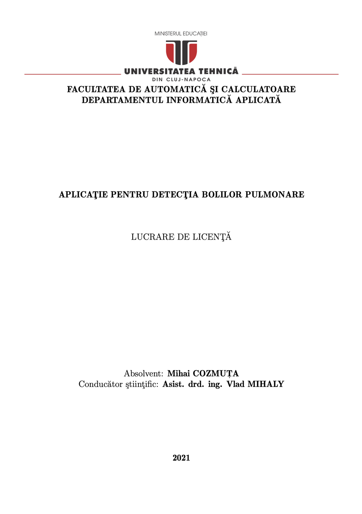

# pneumonia-detection
Pneumonia Detection Using CNN based Feature Extraction

This project served as my undergraduate dissertation as a student of _Technical University of Cluj-Napoca_ (2017-2021)

Please read the attached [documentation](https://github.com/mihaisl/pneumonia-detection/blob/master/documentation/romanian_documentation.pdf) for more information 

